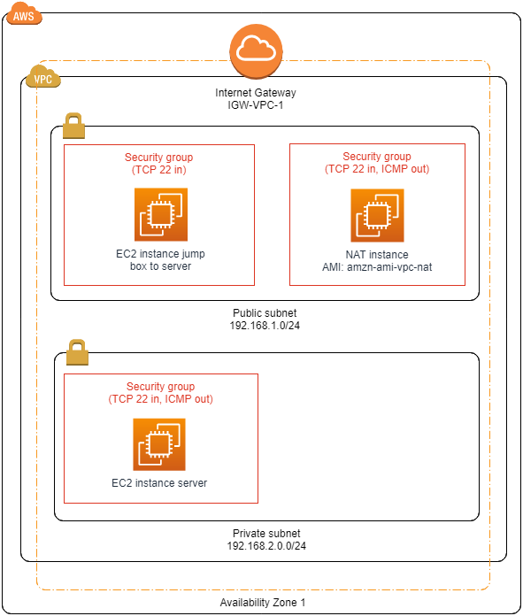

# JumpBox
**Goal of this project**: The goal of this project is two folds:
* to create a JumpBox, a.k.a. a bastion host, which will be the only machine to be able to connect to a back end server.
* Perform a network configuration so that the back end server is only able to perform a PING to the outside world.

To complete this project, the following steps are required:
* Create an Elastic IP@ for NAT instance
* Create Security Groups for EC2 instances in public subnet and private subnet, as well as Security Group for the NAT instance.
* Start the EC2 instance in public subnet
* Start the NAT instance, and:
* * Disable source/destination checks
* * Attach the Elastic IP@
* * Add custom route for outbound traffic
* Start EC2 instance server

The final AWS architecture of this project will look like:

This guide assumes VPC and subnets (at least public) has already been created. For creation of VPC and subnets, one can refer to documentation here [https://github.com/ddumet/AWS-tutorials/tree/master/AWS-r-studio-server-EC2]. In particular, this guide assumes:
* A VPC with an Internet Gateway
* A Public Subnet 192.168.1.0/24 (*public-subnet*), with a **custom Route Table to the Internet Gateway**
* A Private Subnet 192.168.2.0/24 (*private-subnet*)

## Step-1: Create Elastic IP@
Required by the NAT GW/instance. (*Or is it really?!*)

**AWS Console -> Services -> VPC -> Elastic IPs**
* Choose Allocate new address from Amazon pool

## Step-2: Security Group for EC2 instance in Public subnet
Default Security Group does not allow inbound traffic from internet and allow all outbound traffic to the internet.
We create a new security group to allow SSH connection IN and all traffic OUT.

**AWS Console -> Services -> VPC -> Security Groups**, then choose Create Security Group.
* Specify a name (*public-subnet-SSH*)
* Select ID of the VPC
* Choose Create
* Select the Security Group just created
* Inbound Rules tab:
* * Choose edit
* * Choose add rule

|Type  |Protocol  |Port Range|Source|
|------|----------|----------|-------|
|SSH   |TCP     |22|0.0.0.0/0|

## Step-3: Security Group for EC2 instance in Private subnet
We create a new security group to allow SSH connection IN **from the JumpBox subnet only (*public-subnet-SSH*)** and ICMP OUT.

**AWS Console -> Services -> VPC -> Security Groups**, then choose Create Security Group.
* Specify a name (*private-subnet-server*)
* Select ID of the VPC
* Choose Create
* Select the Security Group just created
* Inbound Rules tab:
* * Choose edit
* * Choose add rule

|Type  |Protocol  |Port Range|Source|
|------|----------|----------|-------|
|SSH   |TCP     |22|192.168.1.0/24|

* Outbound Rules tab:
* * Choose edit
* * Choose add rule

|Type  |Protocol  |Port Range|Destination|
|------|----------|----------|-------|
|ALL ICMP -IPV4   |ALL     |N/A|0.0.0.0/0|

## Step-4: Security Group for NAT instance
Enable the NAT instance to receive Internet-bound traffic from instances in a private subnet

**AWS Console -> Services -> VPC -> Security Groups**, then choose Create Security Group.
* Specify a name (*NATSG*)
* Select ID of the VPC
* Choose Create
* Select the Security Group just created
* Inbound Rules tab:
* * Choose edit
* * Choose add rule. We want the private instance to **ONLY** be able to ping (ICMP). Adding just the following inbound rule:

|Type  |Protocol  |Port Range|Source|
|------|----------|----------|-------|
|ALL ICMP -IPV4   |ALL     |N/A|192.168.2.0/24|

## Step-5: Launch EC2 instance - JumpBox
**AWS Console -> Services -> EC2**, then choose Launch Instance.
* **Step 3**: Choose the configured VPC and public subnet (*public-subnet*). Choose **Auto Assign Public IP**.
* **Step 6**: Select Security Group *public-subnet-SSH* allowing SSH access to this public subnet instance.

## Step-6: Launch EC2 instance - NAT instance
**AWS Console -> Services -> EC2**, then choose Launch Instance.
* Search for NAT AMI: **amzn-ami-vpc-nat**
* **Step 3**: Choose the configured VPC and public subnet,
* **Step 6**: Select Security Group *NATSG* defined previously.

### Step-6.1: Once the NAT instance has launched
Each EC2 instance performs source/destination checks by default. We **must** disable this as the NAT instance must be able to send and receive traffic when the source or destination is not itself.

**AWS Console -> Services -> EC2**, dashboard

* Select the NAT instance, choose Actions -> Networking -> Change Source/Dest. -> Check.
* For the NAT instance, verify that this attribute is disabled. Otherwise, choose *Yes, Disable*.

### Step-6.2: Attach Elastic IP@
We attach now the Elastic IP@ to the NAT instance
**AWS Console -> Services -> VPC -> Elastic IPs**
* Select newly created IP@ -> Actions -> Associate address, and select the NAT instance.

### Step-6.3: Custom route table for outbound traffic
We add a custom route table for outbound traffic to be directed to the NAT instance
**AWS Console -> Services -> VPC -> Route Tables**, then choose Create Route Tables.
* Name your route (e.g. private-subnet-route-table)
* Select the VPC to associate the route with
* Create

Edit the Route Table:
* Select the custom Route Table just created,
* On Routes tab, choose Edit, Add another route
* Add 0.0.0.0/0 and select the NAT Instance ID as target
* Save
* on Subnet Associations tab, choose Edit and select the private subnet to associate the Route Table with

## Launch EC2 instance - Server
**AWS Console -> Services -> EC2**, then choose Launch Instance.
* Specify name Server,
* **Step 3**: Choose the configured VPC and *private-subnet* subnet.
* **Step 6**: Select Security Group *private-subnet-server* allowing SSH access to this server instance, and preventing any outbound connection from the server except for **ICMP** traffic.

## Login to jump box and server and check PING is working (and nothing else!)
* SCP the keypair to the jumpbox:  **scp -i "a-keypair.pem" a-keypair.pem ec2-user@jumpbox-instance-public-ip@:~/.**
* SSH to the jumpbox: **ssh -i "a-keypair.pem" ec2-user@jumpbox-instance-public-ip@**
* SSH to the server: **ssh -i "a-keypair.pem" ec2-user@server-instance-public-ip@**
* ping ! (ping www.google.com). **this should work**
* curl ! (curl www.google.com). **this should NOT work**
